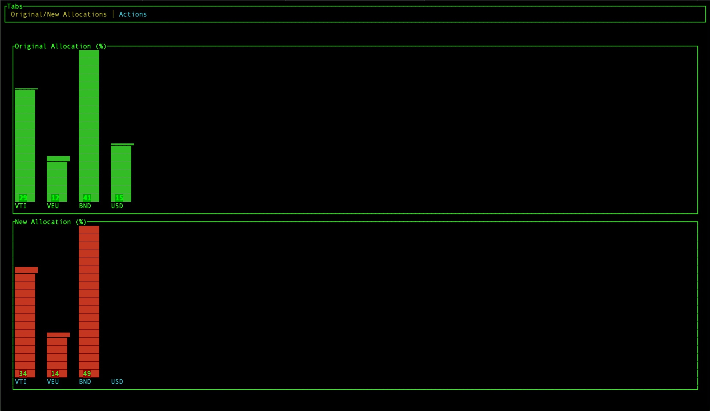
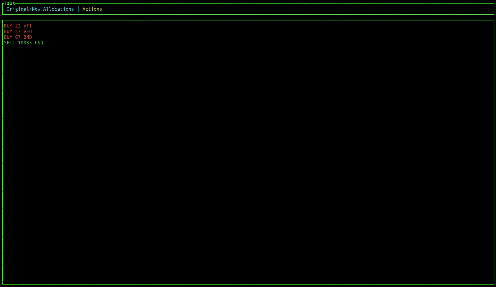

# portfolio-rebalancer

portfolio-rebalancer is a simple command line tool with UI to rebalance your stock portfolios to a target allocation, written in `Rust`.

edit `portfolio.json` with your target allocation and your assets

then run the tool `cargo run portfolio.json`

one tab will show the original allocation and the result

the second tab will show the actions (`BUY` `SELL`) to do to reach the target allocation

NB the math is quite untested, use at your own risk.
